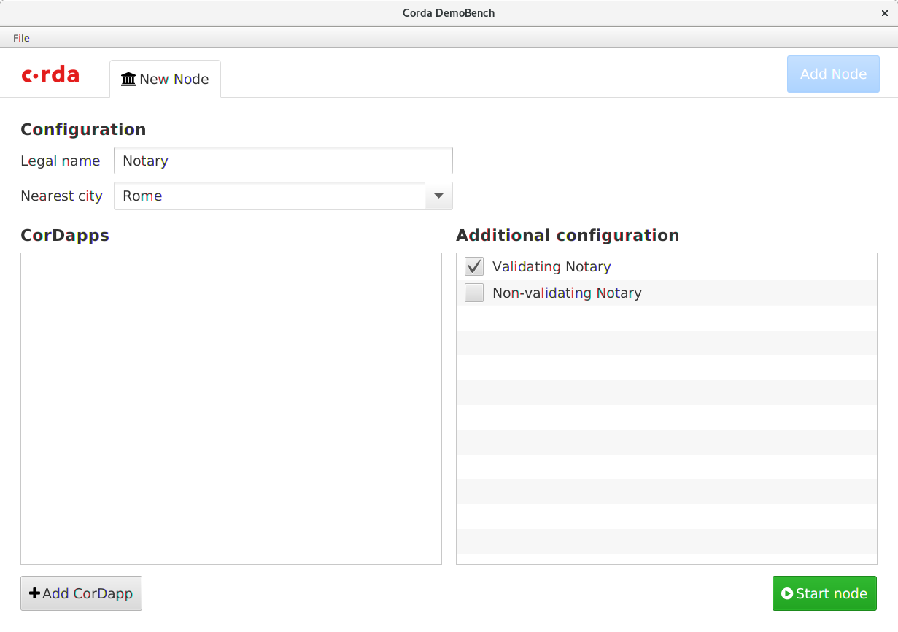
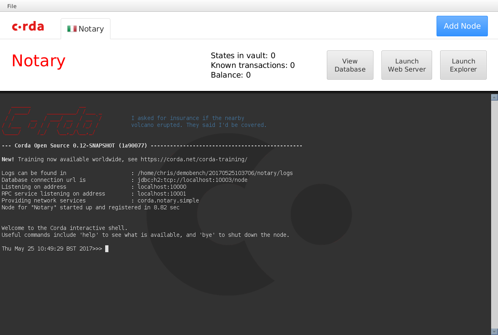
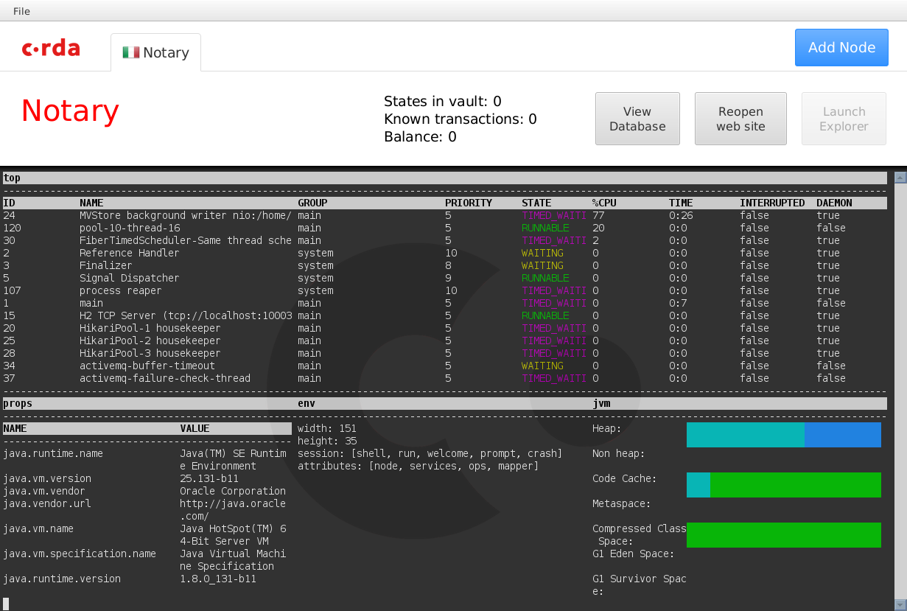
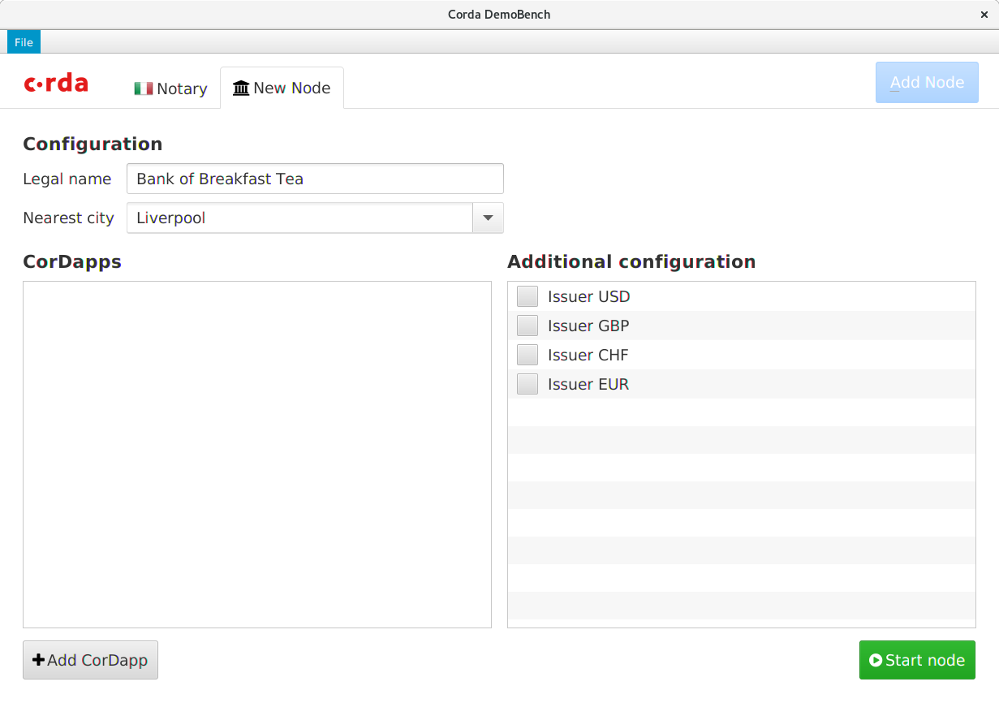
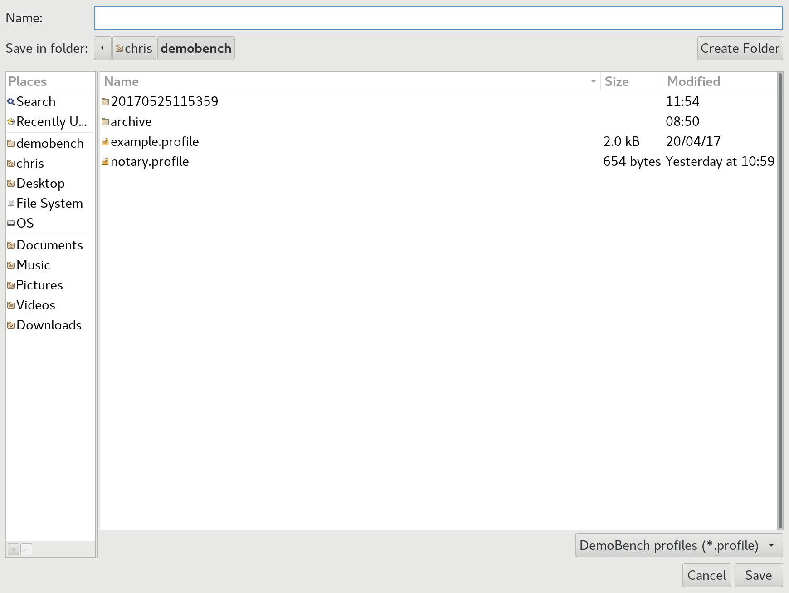

# DemoBench

DemoBench is a standalone desktop application that makes it easy to configure
and launch local Corda nodes. Its general usage is documented
[here](https://docs.corda.net/demobench.html).

## Running locally

**MacOSX/Linux:**

    ./gradlew tools:demobench:installDist
    cd tools/demobench/build/install/demobench
    bin/demobench

**Windows:**

    gradlew tools:demobench:installDist
    cd tools\demobench\build\install\demobench

and then

    bin\demobench

or, if Windows complains that the command line is too long:

    java -Djava.util.logging.config.class=net.corda.demobench.config.LoggingConfig -jar lib\demobench-$version.jar

## Testing
### The Notary Node

When launched, DemoBench will look something like this:



Clicking the `Start node` button should launch a new Notary node.



The tab should display the correct national flag for the node's geographical
location. The `View Database`, `Launch Web Server` and `Launch Explorer` buttons
will be disabled until the node has finished booting, at which point the node
statistics (`States in vault`, `Known transactions` and `Balance`) will become
populated too.

The Corda node should boot into a shell with a command prompt. Type `help` at
this command prompt to list the commands available, followed by `dashboard`.



Press `q` to exit the dashboard, and then check the tab's buttons:

- Press `View Database` to launch the H2 database's Web console in your browser.
Pressing this button again should launch a second console session.
- Press the `Launch Web Server` button to launch the Corda Webserver for this
node. Once booted, it should open your browser to a page saying:
> ### Installed CorDaps
> No installed custom CorDapps

- The button's text should now have changed to `Reopen web site`. Pressing the
button again should open a new session in your browser.

- Press the `Launch Explorer` button to launch the [Node Explorer](https://docs.corda.net/node-explorer.html) for this notary. You should be logged into the
Explorer automatically. The `Launch Explorer` button should now remain disabled
until you close this node's Explorer again.

### The Bank Node

Click the `Add Node` button, and DemoBench will ask you to configure another
node in a new tab.



When you press the `Launch Web Server` this time, your browser should open to a
page saying:
> ### Installed CorDapps
> **net.corda.bank.plugin.BankOfCordaPlugin**<br/>
> net.corda.bank.api.BankOfCordaWebApi:
> - POST issue-asset-request
> - GET date

Clicking on the `GET date` link should return today's date within a JSON document.

Launch the bank's Node Explorer, and check the network view. The Notary node
should be displayed in Rome, whereas the Bank of Breakfast Tea should be in
Liverpool.

## Saving / Loading profiles

Choose `File/Save As` from DemoBench's main menu.



Save the profile and then examine its contents (ZIP format). It should look
something like:

```
  Length      Date    Time    Name
---------  ---------- -----   ----
        0  05-25-2017 11:57   notary/
      490  05-25-2017 11:57   notary/node.conf
        0  05-25-2017 11:57   notary/plugins/
        0  05-25-2017 11:57   bankofbreakfasttea/
      673  05-25-2017 11:57   bankofbreakfasttea/node.conf
        0  05-25-2017 11:57   bankofbreakfasttea/plugins/
---------                     -------
     1163                     6 files
```

Now choose `File/Open` from the main menu, and select the profile that you have
just saved. DemoBench should close the two existing tabs and then relaunch the
Notary and Bank nodes.

## Exiting DemoBench

Close DemoBench as a normal application on your platform; it should close any
open Node Explorers before exiting.
